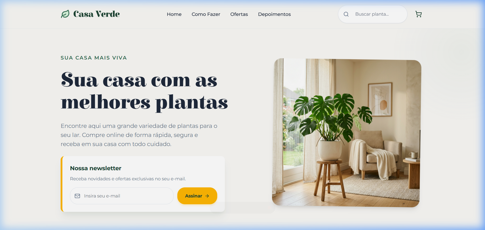

# 🌿 Casa Verde — Loja de Plantas Online

Aplicação web de e-commerce de plantas, desenvolvida com **React + Vite**, estilizada com **Tailwind CSS v4** e utilizando componentes do **Tailgrids**. O projeto foi criado com base em um design do Figma e conta com busca, filtro por categorias, carrinho de compras, newsletter e muito mais.

## 📸 Captura de Tela



---

## 🧩 Visão Geral

- **Framework:** React 19 + Vite 8
- **Estilização:** Tailwind CSS v4 (via `@tailwindcss/vite`) + Tailgrids
- **Ícones:** Lucide React
- **Fontes:** Elsie Swash Caps (títulos) + Montserrat (corpo)
- **Funcionalidades:** busca em tempo real, filtro por categoria, carrinho com badge, newsletter com modal de confirmação e toast de notificação

---

## 📁 Estrutura do Projeto

```
casa-verde/
├── public/
│   ├── images/             # Imagens das plantas e hero
│   │   ├── hero.png
│   │   ├── monstera.png
│   │   ├── ajuga.png
│   │   ├── cordyline.png
│   │   ├── bromelia.png
│   │   ├── cactus.png
│   │   └── orchid.png
│   ├── favicon.svg
│   └── icons.svg
├── src/
│   ├── components/
│   │   ├── Header.jsx      # Navbar sticky com busca e carrinho
│   │   ├── Hero.jsx        # Seção principal com form de newsletter
│   │   ├── HowToGet.jsx    # Seção "3 passos" para conseguir a planta
│   │   ├── PlantOffers.jsx # Grid de produtos com filtro por categoria
│   │   └── Footer.jsx      # Rodapé com links e redes sociais
│   ├── utils/
│   │   └── cn.ts           # Helper de merge de classes Tailwind (Tailgrids)
│   ├── App.jsx             # Shell da aplicação, modal e toast
│   ├── index.css           # Tokens de design (@theme) + animações customizadas
│   └── main.jsx            # Entry point
├── vite.config.js
├── tailgrids.config.json
└── package.json
```

---

## ⚙️ Componentes e Funcionalidades

### 🔍 Busca em Tempo Real — `Header.jsx`

O campo de busca localizado no header envia o termo digitado para o componente `PlantOffers` via prop `searchTerm`. A busca filtra as plantas por nome em tempo real.

```jsx
// Header.jsx — input controlado
<input
  type="text"
  placeholder="Buscar planta..."
  value={searchTerm}
  onChange={(e) => setSearchTerm(e.target.value)}
/>
```

O estado é gerenciado no `App.jsx` e passado por prop:

```jsx
// App.jsx
const [searchTerm, setSearchTerm] = useState('');

<Header searchTerm={searchTerm} setSearchTerm={setSearchTerm} cartCount={cartCount} />
<PlantOffers searchTerm={searchTerm} onAddToCart={handleAddToCart} />
```

---

### 🛒 Carrinho de Compras — `PlantOffers.jsx` + `Header.jsx`

Ao clicar em **"Comprar"** em um card de planta, a função `handleAddToCart` é chamada. Ela incrementa o contador do carrinho e exibe um **toast** de confirmação por 3 segundos.

```jsx
// App.jsx
const handleAddToCart = (plant) => {
  setCartCount((prev) => prev + 1);
  setToastMessage(`"${plant.name}" adicionada ao carrinho!`);
  setShowToast(true);

  const timer = setTimeout(() => {
    setShowToast(false);
  }, 3000);

  return () => clearTimeout(timer);
};
```

O badge do carrinho aparece no header sempre que `cartCount > 0`:

```jsx
// Header.jsx
{cartCount > 0 && (
  <span className="absolute top-0 right-0 bg-[#FFB703] ...">
    {cartCount}
  </span>
)}
```

---

### 🔎 Filtro por Categoria — `PlantOffers.jsx`

As plantas podem ser filtradas por quatro categorias: **Todas**, **Fácil Cultivo**, **Flores** e **Exóticas**. O filtro combina com a busca por nome.

```jsx
const filteredPlants = plantsData.filter((plant) => {
  const matchesSearch = plant.name.toLowerCase().includes(searchTerm.toLowerCase());
  const matchesCategory =
    selectedCategory === 'todas' || plant.category === selectedCategory;
  return matchesSearch && matchesCategory;
});
```

---

### 📧 Newsletter com Modal — `Hero.jsx` + `App.jsx`

O formulário da newsletter valida o e-mail com regex e, se válido, chama `onSubscribe(email)` passado por prop. O `App.jsx` captura o evento e abre um modal de confirmação com o e-mail do usuário.

```jsx
// Hero.jsx — validação
const emailRegex = /^[^\s@]+@[^\s@]+\.[^\s@]+$/;
if (!emailRegex.test(email)) {
  setError('Por favor, insira um e-mail válido.');
  return;
}
onSubscribe(email); // dispara o modal no App

// App.jsx — abertura do modal
const handleSubscribe = (email) => {
  setSubscriberEmail(email);
  setIsModalOpen(true);
};
```

---

### 🎨 Tokens de Design — `src/index.css`

Todas as cores, fontes e sombras do projeto são definidas como variáveis CSS via `@theme` do Tailwind v4, garantindo consistência em toda a aplicação:

```css
@theme {
  --color-primary-green: #1B4332;
  --color-secondary-green: #2D6A4F;
  --color-accent-gold: #FFB703;
  --color-bg-cream: #FAF9F6;
  --font-heading: 'Elsie Swash Caps', serif;
  --font-body: 'Montserrat', sans-serif;
  /* ... */
}
```

---

## 🚀 Como Rodar

### Pré-requisitos

- [Node.js](https://nodejs.org/) v18+
- npm v9+

### Instalação

```bash
# Clone o repositório
git clone https://github.com/seu-usuario/casa-verde.git
cd casa-verde

# Instale as dependências
npm install
```

### Desenvolvimento (com HMR)

```bash
npm run dev
```

Acesse em: [http://localhost:5173](http://localhost:5173)

### Build para Produção

```bash
npm run build
```

Os arquivos otimizados serão gerados na pasta `dist/`.

### Preview do Build

```bash
npm run preview
```

### Lint

```bash
npm run lint
```

---

## 🛠️ Stack Tecnológica

| Tecnologia | Versão | Uso |
|---|---|---|
| React | ^19 | Framework UI |
| Vite | ^8 | Build tool e dev server |
| Tailwind CSS | v4 | Estilização via utility classes |
| Tailgrids | latest | Componentes UI prontos |
| Lucide React | ^1.17 | Biblioteca de ícones |
| clsx + tailwind-merge | latest | Composição de classes CSS |

---

## 📦 Scripts Disponíveis

| Script | Comando | Descrição |
|---|---|---|
| Desenvolvimento | `npm run dev` | Inicia o servidor local com HMR |
| Build | `npm run build` | Gera o bundle de produção |
| Preview | `npm run preview` | Visualiza o build localmente |
| Lint | `npm run lint` | Verifica a qualidade do código |

---

## 🎨 Design

O projeto foi desenvolvido com base em um design do **Figma** com as seguintes escolhas visuais:

- **Cor primária:** Verde escuro `#1B4332`
- **Cor de destaque:** Dourado `#FFB703`
- **Fundo:** Creme `#FAF9F6`
- **Fonte para títulos:** Elsie Swash Caps (serif)
- **Fonte para corpo:** Montserrat (sans-serif)
- **Animações:** Blob animado no hero, transições suaves em hover, toast com slide-in, modal com scale-in

---

## 🤖 Programação Orientada a IA

Este projeto foi desenvolvido explorando o conceito de **Programação Orientada a IA (AI-Oriented Programming)** — uma abordagem onde o desenvolvedor atua como **condutor das decisões** enquanto um agente de IA executa, sugere e refina o código em ciclos contínuos de colaboração.

### O que é Programação Orientada a IA?

É uma metodologia de desenvolvimento onde:

- O desenvolvedor define **intenções e requisitos** em linguagem natural
- A IA **propõe soluções**, gera código e toma decisões técnicas
- O desenvolvedor **revisa, aprova ou redireciona** cada etapa
- A IA **itera e corrige** com base no feedback recebido

Diferente do uso pontual de IA para autocompletar trechos de código, aqui a IA participou ativamente de todo o ciclo de vida do projeto — do planejamento à execução.

### Como foi aplicado neste projeto

| Etapa | Participação da IA |
|---|---|
| **Análise do Figma** | A IA interpretou o design e mapeou os componentes necessários |
| **Arquitetura** | A IA definiu a estrutura de pastas, estado global e fluxo de props |
| **Criação dos componentes** | Todos os 5 componentes React foram gerados pela IA com base nos requisitos |
| **Migração para Tailwind** | A IA criou um plano de migração, instalou dependências e reescreveu cada componente |
| **Integração do Tailgrids** | A IA executou o CLI do Tailgrids, respondeu prompts interativos e configurou os tokens |
| **Revisão e ajustes** | A cada etapa, o desenvolvedor revisou e direcionou as correções necessárias |
| **Documentação** | Este próprio README foi gerado pela IA com base na estrutura real do projeto |

### Fluxo de colaboração humano-IA

```
Desenvolvedor (intenção)
        │
        ▼
    IA analisa o contexto
        │
        ▼
    IA propõe e executa
        │
        ▼
Desenvolvedor revisa/aprova
        │
        ▼
    IA itera e refina
        │
        └──── repete até o objetivo ser atingido
```

### Benefícios observados

- ⚡ **Velocidade:** todo o projeto foi estruturado e migrado em uma única sessão
- 🎯 **Foco no que importa:** o desenvolvedor direcionou decisões de produto e design sem se perder em detalhes de implementação
- 📐 **Consistência:** a IA manteve padrões de código e nomenclatura uniformes em todos os arquivos
- 🔄 **Iteração rápida:** mudanças de requisito foram incorporadas sem retrabalho manual extenso

> Este projeto é um exemplo prático de como a IA pode atuar como um **par de programação ativo**, elevando a produtividade e permitindo que o desenvolvedor concentre sua energia em decisões estratégicas.

---

## 📄 Licença

Projeto desenvolvido para fins de estudo. Livre para uso e modificação.
